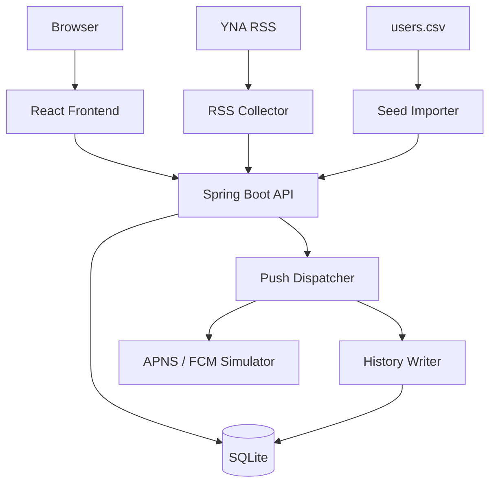
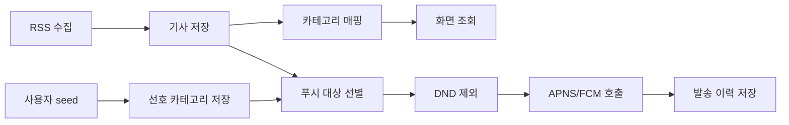

# 시스템 아키텍처

## 목표

짧은 과제 기간 안에 평가자가 바로 실행하고 확인할 수 있는 풀스택 애플리케이션을 만든다. 핵심은 화려한 기능보다 RSS 수집, 데이터 정합성, 푸시 발송 이력, UI 흐름, README 재현성이다.

## 디렉터리

```text
news-pulse/
  new-pulse-frontend/     # React/Vite 프론트엔드
  new-pulse-backend/      # Spring Boot 백엔드
  new-pulse-docs/         # 설계, 검증, 배포 문서
```

## 시스템 구성

이 그림은 평가자가 로컬 Docker 또는 OCI 배포 환경에서 앱을 열었을 때 어떤 구성요소가 연결되는지를 보여준다. 긴 설명은 다이어그램 밖의 항목으로 분리하고, 그림 안에는 역할만 표시한다.



구성요소의 책임은 다음과 같다.

| 구성요소 | 책임 |
| --- | --- |
| Browser | 카테고리, 기사 목록, 상세 화면을 사용한다. 읽음 상태는 브라우저 `client_id` 기준으로 저장된다. |
| React Frontend | 화면 route, 기사 목록 `더보기`, 읽음/미읽음 표시, 원문 새 탭 열기를 담당한다. |
| Spring Boot API | 화면 API, RSS 수집, 사용자 seed 적재, 푸시 시뮬레이션 흐름을 제공한다. |
| SQLite | 기사, 카테고리 매핑, 읽음 상태, 사용자 seed, 푸시 발송 이력을 저장한다. |
| RSS Collector | 연합뉴스 RSS 5개 카테고리를 수집하고 중복 기사와 최대 1,000건 제한을 처리한다. |
| Seed Importer | `users.csv` 100명과 선호 카테고리를 `users`, `user_preferences`에 적재한다. |
| Push Dispatcher | 기사 카테고리와 사용자 선호 카테고리를 매칭하고 DND 시간대 사용자를 제외한다. |
| APNS / FCM Simulator | 실제 외부 발송 없이 `success` 또는 `fail`을 반환한다. |
| History Writer | 발송 결과를 `push_histories`에 저장한다. |

위 그림은 배포 구조가 아니라 애플리케이션 구성과 데이터 흐름을 설명한다. OCI의 `edge-vm -> front-vm -> back-vm` 배포 구조와 네트워크 정책은 [OCI 인프라 아키텍처](05-deployment-oci.md)를 기준으로 확인한다.

## 주요 데이터 흐름



## 설계 결정 이유

- 단일 백엔드 애플리케이션으로 RSS 수집, API, 푸시 발송을 처리한다. 과제 규모에서 별도 worker나 message queue를 두면 운영 복잡도만 늘어난다.
- DB는 SQLite 고정이므로 JPA보다 JDBC를 우선한다. 스키마와 SQL을 명시하면 평가자가 DB 구조와 조회 결과를 빠르게 검증할 수 있다.
- 기사와 카테고리는 다대다 구조로 둔다. 같은 기사 링크가 여러 카테고리에 노출될 수 있고, article table에 category를 단일 컬럼으로 넣으면 중복 기사 제거와 카테고리 조회가 충돌한다.
- 읽음 상태는 `client_id + article_id`로 분리한다. 과제 요구사항은 로그인이나 사용자 계정 관리가 아니라, 사용자가 클릭한 기사를 읽음으로 표시하고 목록에서 시각적으로 구분하는 것이다. 제공 사용자 데이터도 웹 로그인 사용자가 아니라 푸시 발송 대상자 seed이므로, 이를 웹 계정 모델로 확장하면 과제 범위를 벗어난다. 따라서 로그인, 세션, JWT, Redis를 추가하지 않고 브라우저 익명 식별자와 SQLite 저장만으로 읽음 상태를 구현한다.
- 카테고리 현황은 저장된 전체 기사 수를 보여주고, 목록은 최신순으로 50건씩 가져온 뒤 `더보기`로 다음 offset을 요청한다. 검색/정렬은 과제 요구 범위를 넘기고 UI와 API 복잡도를 키우므로 제외했다. RSS 뉴스 앱의 기본 흐름은 최신 기사부터 빠르게 읽고 더 필요한 경우 이어서 탐색하는 것이므로, 최신순 정렬과 더보기형 페이징에 집중한다.
- 푸시 발송 이력은 append-only 성격으로 저장한다. 과제의 검증 포인트가 결과 이력 확인이므로 삭제/수정 흐름을 만들지 않는다.
- 푸시 실패는 재시도하지 않고 실패 이력으로 저장한다. 재시도 큐를 만들면 별도 스케줄러, retry policy, backoff, idempotency, 실패 횟수 관리까지 필요해져 과제 범위를 크게 넓힌다. 과제 핵심은 발송 결과를 DB에 저장해 평가자가 확인할 수 있는가이므로, `fail`도 `success`와 같은 이력 데이터로 남기는 방식이 적절하다.
- 본문 페이지는 RSS item의 link URL을 새 탭으로 여는 방식을 선택한다. 과제는 iframe 또는 새 창/탭 중 하나를 허용하므로, 안정성과 역할 경계를 우선했다. 이 앱은 기사 제목, 작성자, 발행 시간, 카테고리, 읽음 상태 같은 RSS 메타데이터를 관리하고, 본문 소비는 원 출처로 연결한다. 직접 crawler 서버를 만들어 본문을 저장·표시하면 저작권, 출처 표기, 본문 최신성, 삭제/수정 반영, HTML sanitizing, 이미지/동영상 자산 처리 문제가 함께 생긴다. iframe 방식도 언론사 CSP 또는 X-Frame-Options 정책으로 차단될 수 있으므로, 새 탭 방식이 앱 상태를 유지하면서 원문 출처와 최신 본문을 보장하는 실용적인 선택이다.

## 런타임 흐름

1. 애플리케이션 시작 시 SQLite 스키마를 초기화한다.
2. 사용자 데이터는 로컬 Excel 또는 사전 변환된 seed를 통해 적재한다.
3. 스케줄러가 10분마다 RSS를 수집한다.
4. 신규 기사만 저장하고, 기사 수가 1,000건을 넘으면 오래된 기사부터 정리한다.
5. 신규 기사와 사용자 선호 카테고리를 매칭한다.
6. 방해 금지 시간에 해당하지 않는 사용자에게만 APNS/FCM 시뮬레이션 서비스를 호출한다.
7. 호출 결과를 SQLite 발송 이력 테이블에 저장한다.
8. 프론트엔드는 REST API로 카테고리, 기사 목록, 읽음 상태, 상세 진입을 처리한다.

## 의존성 방향

```text
Controller -> Service -> Repository -> SQLite
Scheduler  -> Service -> Repository -> SQLite
Service    -> PushNotificationService interface
Frontend   -> REST API only
```

- Controller는 HTTP 요청/응답 변환만 담당한다.
- Service는 업무 규칙을 담당한다.
- Repository는 SQL과 영속성만 담당한다.
- 외부 RSS, push simulation, clock은 인터페이스 뒤에 둔다.
- 프론트엔드는 DB 구조를 알지 못하고 REST API 계약만 사용한다.
