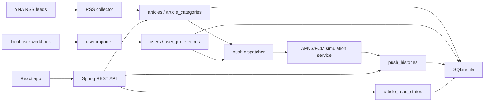

# 시스템 아키텍처

## 목표

짧은 과제 기간 안에 평가자가 바로 실행하고 확인할 수 있는 풀스택 애플리케이션을 만든다. 핵심은 화려한 기능보다 RSS 수집, 데이터 정합성, 푸시 발송 이력, UI 흐름, README 재현성이다.

## 디렉터리

```text
news-pulse/
  new-pulse-frontend/     # React/Vite 프론트엔드
  new-pulse-backend/      # Spring Boot 백엔드
  new-pulse-docs/         # 설계, 검증, 배포 문서
```

## 시스템 구성



## 설계 결정 이유

- 단일 백엔드 애플리케이션으로 RSS 수집, API, 푸시 발송을 처리한다. 과제 규모에서 별도 worker나 message queue를 두면 운영 복잡도만 늘어난다.
- DB는 SQLite 고정이므로 JPA보다 JDBC를 우선한다. 스키마와 SQL을 명시하면 평가자가 DB 구조와 조회 결과를 빠르게 검증할 수 있다.
- 기사와 카테고리는 다대다 구조로 둔다. 같은 기사 링크가 여러 카테고리에 노출될 수 있고, article table에 category를 단일 컬럼으로 넣으면 중복 기사 제거와 카테고리 조회가 충돌한다.
- 읽음 상태는 선택지 A 기준으로 `client_id + article_id`로 분리한다. 로그인, 세션, JWT, Redis 없이 브라우저 익명 식별자와 SQLite 저장만 사용한다.
- 푸시 발송 이력은 append-only 성격으로 저장한다. 과제의 검증 포인트가 결과 이력 확인이므로 삭제/수정 흐름을 만들지 않는다.
- 기사 본문 소비는 원 출처 새 탭 연결을 기본으로 한다. 이 RSS 앱은 기사 메타데이터와 읽음 상태를 관리하는 것이 핵심이며, 직접 crawler 서버를 만들어 본문을 저장·표시하면 저작권, 출처 표기, 본문 최신성, 삭제/수정 반영, HTML sanitizing, 이미지/동영상 자산 처리 문제가 함께 생긴다. iframe 방식도 언론사 CSP 또는 X-Frame-Options 정책으로 차단될 수 있으므로, 새 탭 방식이 앱 상태를 유지하면서 원문 출처와 최신 본문을 보장하는 실용적인 선택이다.

## 런타임 흐름

1. 애플리케이션 시작 시 SQLite 스키마를 초기화한다.
2. 사용자 데이터는 로컬 Excel 또는 사전 변환된 seed를 통해 적재한다.
3. 스케줄러가 10분마다 RSS를 수집한다.
4. 신규 기사만 저장하고, 기사 수가 1,000건을 넘으면 오래된 기사부터 정리한다.
5. 신규 기사와 사용자 선호 카테고리를 매칭한다.
6. 방해 금지 시간에 해당하지 않는 사용자에게만 APNS/FCM 시뮬레이션 서비스를 호출한다.
7. 호출 결과를 SQLite 발송 이력 테이블에 저장한다.
8. 프론트엔드는 REST API로 카테고리, 기사 목록, 읽음 상태, 상세 진입을 처리한다.

## 의존성 방향

```text
Controller -> Service -> Repository -> SQLite
Scheduler  -> Service -> Repository -> SQLite
Service    -> PushNotificationService interface
Frontend   -> REST API only
```

- Controller는 HTTP 요청/응답 변환만 담당한다.
- Service는 업무 규칙을 담당한다.
- Repository는 SQL과 영속성만 담당한다.
- 외부 RSS, push simulation, clock은 인터페이스 뒤에 둔다.
- 프론트엔드는 DB 구조를 알지 못하고 REST API 계약만 사용한다.
