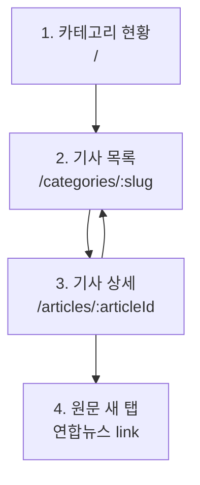

# 프론트엔드 설계

## 기술 스택

- React 19.2 계열
- Vite 8
- TypeScript
- React Router
- TanStack Query
- Tailwind CSS 4.3
- lucide-react
- Vitest, React Testing Library
- Playwright

선택 이유는 단순하다. 과제는 서버 데이터 목록과 상태 표시가 핵심이므로 React SPA와 REST API 조합이 빠르고 재현성이 좋다. Vite는 빌드와 개발 서버가 빠르고, Tailwind는 짧은 시간 안에 일관된 UI를 만들기 좋다.

## 화면 흐름

화면 흐름은 사용자가 브라우저에서 뉴스를 확인하는 순서다. 과제 요구사항의 `카테고리 선택 -> 기사 리스트 -> 본문 확인 -> 읽음 상태 반영`을 프론트엔드 route로 나누어 구현했다.



| 단계 | 화면 | 사용자 행동 | 주요 API |
| --- | --- | --- | --- |
| 1 | 카테고리 현황 | 정치, 북한, 경제, 산업, 사회 중 하나를 선택한다. | `GET /api/categories` |
| 2 | 기사 목록 | 최신 기사 50건을 확인하고 필요하면 `더보기`로 다음 50건을 불러온다. | `GET /api/articles?category=...&limit=50&offset=...` |
| 3 | 기사 상세 | 선택한 기사 메타데이터를 확인한다. 상세 진입 시 읽음 상태가 저장된다. | `GET /api/articles/{articleId}`, `PUT /api/articles/{articleId}/read-state` |
| 4 | 원문 새 탭 | `연합뉴스 원문 보기` 버튼으로 원 출처의 본문을 연다. | 외부 URL |

화면 route의 카테고리 식별자는 lowercase slug를 사용한다. 예를 들어 산업은 `/categories/industry`, 북한은 `/categories/north-korea`로 접근한다. API 계약은 기존 enum code를 유지하므로 화면 URL이 `/categories/industry`여도 기사 목록 API는 `category=INDUSTRY`로 호출한다. 기존 enum code 기반 대문자 URL도 호환하되, 화면에서는 canonical lowercase slug로 replace navigation한다.

## 화면 구성

1. 카테고리 선택 화면
   - 5개 카테고리를 한 화면에 표시한다.
   - 카테고리별 저장된 전체 기사 수와 미읽음 수를 함께 보여준다.
   - 첫 화면은 마케팅 랜딩이 아니라 실제 사용 화면으로 구성한다.

2. 기사 리스트 화면
   - 선택 카테고리명과 기사 목록을 표시한다.
   - 목록은 최신순으로 50건씩 가져오고, `더보기` 버튼으로 다음 offset을 이어서 불러온다.
   - 상단에는 `전체 N건 중 M건 표시` 형태로 현재 표시 범위를 보여준다.
   - 카테고리 현황의 기사 수는 저장된 전체 기사 수이며, 리스트의 표시 건수는 현재 로드한 page 누적 건수다.
   - 검색/정렬은 과제 요구 범위를 넘기므로 제외하고, 최신순 읽기 흐름과 읽음 상태 구분에 집중한다.
   - 미읽음 기사는 굵은 제목과 강조 배지로 구분한다.
   - 읽은 기사는 낮은 대비와 읽음 아이콘으로 구분한다.
   - 제목, 기자명, 발행 시간을 표시한다.

3. 본문 페이지
   - 진입 즉시 읽음 API를 호출한다.
   - 원문 링크는 `연합뉴스 원문 보기` 버튼으로 제공하고 새 탭으로 연다.
   - RSS 앱은 기사 메타데이터와 읽음 상태를 관리하고, 본문 소비는 원 출처로 연결한다.
   - 직접 crawler 서버를 만들어 본문을 저장·표시할 수도 있지만 과제 규모가 커지고, 저작권, 출처 표기, 본문 최신성, 삭제/수정 반영, HTML sanitizing, 이미지/동영상 자산 처리 문제가 생긴다.
   - iframe은 언론사 CSP 또는 X-Frame-Options 같은 보안 정책으로 차단될 수 있으므로 기본 UX는 새 탭 열기로 둔다.
   - 새 탭 방식은 사용자가 앱 목록/읽음 상태를 유지한 채 원문 출처의 최신 본문을 확인할 수 있는 실용적 선택이다.
   - 기사 메타데이터와 목록 복귀 버튼을 제공한다.

## 상태 관리

- 서버 상태: TanStack Query
- 기사 목록 페이징: TanStack Query `useInfiniteQuery`와 API `page.nextOffset`
- clientId: 브라우저 localStorage에 `news-pulse-client-id`로 저장
- 읽음 상태: 백엔드 `article_read_states` 기준
- UI 상태: URL params와 컴포넌트 local state만 사용

## 컴포넌트 초안

```text
src/
  app/
    router.tsx
  api/
    client.ts
    articles.ts
    categories.ts
  components/
    AppShell.tsx
    CategoryCard.tsx
    ArticleListItem.tsx
    StatusBadge.tsx
    EmptyState.tsx
    ErrorState.tsx
  pages/
    CategoryOverviewPage.tsx
    ArticleListPage.tsx
    ArticleDetailPage.tsx
```

## 컴포넌트 분리 기준

- 프론트엔드는 page, feature component, shared component, api client를 분리한다. 화면 단위 변경과 API 계약 변경이 서로 번지지 않게 하기 위함이다.
- Page 컴포넌트는 라우팅, query 조합, 화면 레이아웃만 담당한다.
- API 호출은 `api/`와 query hook으로 분리한다. 컴포넌트 내부에서 `fetch`를 직접 흩뿌리지 않는다.
- 반복 UI는 컴포넌트로 분리한다. 기사 row, 카테고리 카드, 상태 배지, 에러/빈 상태는 각각 독립 컴포넌트로 둔다.
- 한 컴포넌트가 150라인을 넘기거나 state가 3개 이상이면 분리 후보로 본다.
- 도메인 타입은 `types/` 또는 API 모듈에서 정의하고 props에 `any`를 사용하지 않는다.
- 아이콘 버튼은 `lucide-react`를 우선 사용하고, 의미가 불명확한 아이콘에는 tooltip 또는 `aria-label`을 둔다.

## 디렉터리 설계 이유

- `pages/`: URL route와 1:1로 대응한다. 데이터 fetch hook 조합은 page에서 수행한다.
- `components/`: 재사용 가능한 순수 UI 단위만 둔다. 도메인 API를 직접 호출하지 않는다.
- `api/`: REST endpoint와 DTO 변환을 캡슐화한다. endpoint 문자열이 화면에 퍼지지 않게 한다.
- `hooks/`: TanStack Query hook을 둔다. cache key와 invalidation 규칙을 한 곳에서 관리한다.
- `types/`: API 응답과 화면 props에서 공유하는 타입을 둔다.
- `utils/`: 날짜 포맷, client id 생성처럼 UI와 독립적인 순수 함수를 둔다.

## 컴포넌트 책임 예시

- `CategoryOverviewPage`: 카테고리 목록 query 실행, category card grid 구성
- `CategoryCard`: 카테고리명, 전체 기사 수, 미읽음 수 표시
- `ArticleListPage`: category route param 검증, 기사 목록 query 실행
- `ArticleListItem`: 기사 메타데이터와 읽음/미읽음 표시
- `ArticleDetailPage`: 상세 조회, 읽음 처리 mutation, 원문 열기 버튼 제공
- `AppShell`: 공통 헤더, responsive content width, 오류 boundary 배치
- `StatusBadge`: 읽음/미읽음, 발송 성공/실패 같은 상태 표시 재사용

## 프론트엔드 SOLID 적용 기준

- SRP: 화면, API client, query hook, presentational component를 분리한다.
- OCP: 새 카테고리가 추가되어도 카테고리 카드 렌더링 로직은 데이터 배열 확장만으로 대응하게 한다.
- LSP: 공통 `StatusBadge`, `EmptyState`, `ErrorState`는 어느 page에서 사용해도 같은 props 계약을 지킨다.
- ISP: 컴포넌트 props는 필요한 값만 받는다. page 전체 상태 객체를 통째로 넘기지 않는다.
- DIP: 화면 컴포넌트는 `fetch` 구현이 아니라 API 함수와 query hook에 의존한다.

## 접근성과 UX 기준

- 기사 제목 링크와 원문 열기 버튼은 키보드로 접근 가능해야 한다.
- 읽음/미읽음 구분은 색상만 의존하지 않는다. 굵기, 아이콘, 텍스트 배지를 함께 사용한다.
- 로딩, 에러, 빈 목록 상태를 모두 구현한다.
- 모바일에서도 제목, 기자명, 발행 시간이 겹치지 않도록 responsive layout을 사용한다.
- 첫 화면은 실제 카테고리 선택 화면이어야 한다. 마케팅 랜딩 페이지를 만들지 않는다.

## 스크린샷 계획

최종 README에는 최소 3장을 포함한다.

- 카테고리 선택 화면
- 기사 리스트 화면, 읽음/미읽음 구분 포함
- 본문 페이지 또는 원문 새 탭 진입 화면

Playwright로 데스크톱 기준 스크린샷을 생성하고, 필요하면 모바일 화면 1장을 추가한다.
