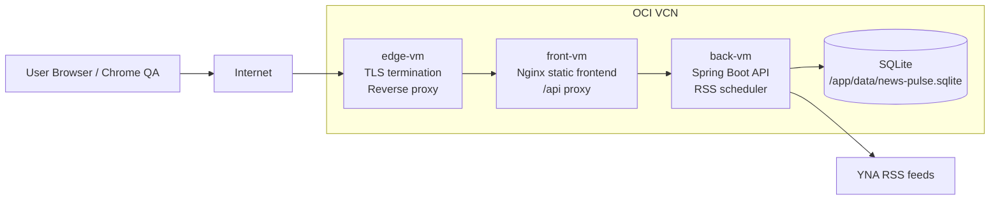

# OCI 인프라 아키텍처

## 목표

`news-pulse`를 OCI에서 `edge-vm`, `front-vm`, `back-vm`으로 분리해 배포한다. 외부 진입점은 edge-vm에만 두고, front-vm은 정적 프론트엔드와 `/api` 프록시, back-vm은 Spring Boot와 SQLite를 담당한다.

## VM 역할

| VM | 역할 | 외부 노출 | 주요 구성 |
| --- | --- | --- | --- |
| edge-vm | 인터넷 진입점, TLS, reverse proxy | 80/443 | Nginx 또는 Caddy |
| front-vm | React 정적 파일 서빙, `/api` upstream proxy | edge-vm에서만 접근 | Nginx, frontend container |
| back-vm | Spring Boot API, scheduler, SQLite volume | front-vm에서만 접근 | backend container, SQLite data volume |

## 아키텍처 다이어그램



## 네트워크 정책

- public inbound는 edge-vm의 80/443만 허용한다.
- front-vm은 edge-vm에서 오는 HTTP 트래픽만 허용한다.
- back-vm은 front-vm에서 오는 backend port만 허용한다.
- back-vm outbound는 RSS 수집을 위해 HTTPS를 허용한다.
- SQLite 파일은 back-vm host volume에만 둔다.

## 컨테이너 구성

```text
front-vm:
  news-pulse-frontend
  image: news-pulse-frontend:latest
  port: 80
  upstream: http://<back-vm-private-ip>:8080

back-vm:
  news-pulse-backend
  image: news-pulse-backend:latest
  port: 8080
  volume: /opt/news-pulse/data:/app/data
  env: SPRING_PROFILES_ACTIVE=prod

edge-vm:
  reverse proxy
  public: 80/443
  upstream: http://<front-vm-private-ip>:80
```

프론트엔드는 Vite build 산출물을 Nginx로 서빙한다. front-vm의 Nginx는 `/api` 요청만 back-vm으로 프록시한다. edge-vm은 외부 TLS와 front-vm upstream만 담당한다.

## 배포 파일

```text
news-pulse/
  new-pulse-backend/Dockerfile
  new-pulse-frontend/Dockerfile
  docker-compose.local.yml
  deploy/
    edge/
      nginx.conf
    front/
      docker-compose.yml
      nginx.conf
      .env.example
    back/
      docker-compose.yml
      .env.example
```

- Docker build context는 repository root를 사용한다.
- root `.dockerignore`는 원본 첨부 파일, `.env`, runtime DB, build output이 image context로 들어가지 않게 막는다.
- `deploy/back/docker-compose.yml`은 `BACKEND_BIND_ADDRESS`를 필수로 요구한다. 이 값은 back-vm private IP여야 하며, `0.0.0.0`을 사용하지 않는다.
- `deploy/front/docker-compose.yml`은 `FRONT_BIND_ADDRESS`, `BACKEND_HOST`를 필수로 요구한다. front bind는 front-vm private IP, backend host는 back-vm private IP 또는 private DNS다.

## SQLite 볼륨

- back-vm 운영 DB 경로: `/opt/news-pulse/data/news-pulse.sqlite`
- 컨테이너 내부 경로: `/app/data/news-pulse.sqlite`
- 검증용 DB/CSV는 개발 완료 후 `new-pulse-backend/deliverables/`에 복사한다.
- 컨테이너는 non-root UID/GID `10001`로 실행하므로, back-vm에서 data directory 소유권을 맞춘다.

```bash
sudo mkdir -p /opt/news-pulse/data /opt/news-pulse/backups
sudo chown -R 10001:10001 /opt/news-pulse/data
```

배포 전후 SQLite 백업은 `sqlite3`의 online backup 명령을 사용한다.

```bash
sqlite3 /opt/news-pulse/data/news-pulse.sqlite \
  ".backup '/opt/news-pulse/backups/news-pulse-$(date +%Y%m%d%H%M%S).sqlite'"
```

## 인프라 설계 이유

- VM 역할을 edge/front/back으로 분리해 외부 노출, 정적 서빙, 백엔드 상태 저장 책임을 분리한다.
- Docker Compose를 사용해 각 VM의 컨테이너 실행 방식을 재현 가능하게 유지한다.
- SQLite는 컨테이너 내부 레이어가 아니라 host volume에 둔다. 컨테이너 재생성 시 데이터가 사라지지 않게 하기 위함이다.
- 프론트엔드는 Nginx로 정적 파일을 서빙하고 `/api`만 백엔드로 프록시한다. 브라우저 CORS 설정을 단순화하고 단일 origin으로 시연하기 위함이다.
- backend는 외부에 직접 노출하지 않고 front-vm에서만 접근하게 한다.

## 이미지 빌드

```bash
docker build -f new-pulse-backend/Dockerfile -t news-pulse-backend:latest .
docker build -f new-pulse-frontend/Dockerfile -t news-pulse-frontend:latest .
```

registry를 사용한다면 위 이미지를 push하고, 각 VM의 `.env`에서 `BACKEND_IMAGE`, `FRONTEND_IMAGE`를 registry 경로로 바꾼다.

## 배포 순서 초안

back-vm:

```bash
ssh opc@<back-vm>
sudo mkdir -p /opt/news-pulse/data /opt/news-pulse/backups
sudo chown -R 10001:10001 /opt/news-pulse/data
cd /opt/news-pulse/deploy/back
cp .env.example .env
vi .env

docker compose -p news-pulse-backend pull
docker compose -p news-pulse-backend up -d
docker compose -p news-pulse-backend ps
docker logs --tail=100 news-pulse-backend
curl -fsS http://127.0.0.1:8080/api/health
```

front-vm:

```bash
ssh opc@<front-vm>
cd /opt/news-pulse/deploy/front
cp .env.example .env
vi .env

docker compose -p news-pulse-frontend pull
docker compose -p news-pulse-frontend up -d
docker compose -p news-pulse-frontend ps
curl -fsS http://127.0.0.1/healthz
curl -fsS http://<front-vm-private-ip>/api/health
```

edge-vm:

```bash
ssh opc@<edge-vm>
sudo cp /opt/news-pulse/deploy/edge/nginx.conf /etc/nginx/conf.d/news-pulse.conf
sudo vi /etc/nginx/conf.d/news-pulse.conf
sudo nginx -t
sudo systemctl reload nginx
curl -fsS http://<edge-public-host>/api/health
```

`deploy/edge/nginx.conf`의 `front-vm:80`은 front-vm private DNS 이름으로 해석되게 하거나, edge-vm의 `/etc/hosts`에 front-vm private IP를 등록한다.

```text
deploy/
  edge/
    nginx.conf
  front/
    docker-compose.yml
    nginx.conf
  back/
    docker-compose.yml
    .env.example
```

## 로컬 검증용 compose

로컬 개발에서는 VM 분리 대신 단일 `docker-compose.local.yml`로 frontend/backend를 함께 띄운다. OCI 배포 파일과 혼동하지 않도록 파일명을 분리한다.

```bash
docker compose -f docker-compose.local.yml -p news-pulse up --build
docker compose -f docker-compose.local.yml -p news-pulse ps
```

로컬 compose endpoint:

- frontend: `http://localhost:3000`
- backend health: `http://localhost:8080/api/health`

프론트엔드 skeleton이 생성되기 전에는 `new-pulse-frontend/package*.json`이 없어 frontend image build가 실패한다. M6 프론트엔드 구현 후 같은 compose 파일로 통합 실행한다.

운영 중인 다른 서비스가 같은 포트를 쓰고 있으면 edge-vm reverse proxy host/path 규칙을 조정한다.

## 점검

- `GET /api/health` 응답 확인
- 프론트 첫 화면 접근 확인
- 수동 RSS 수집 API 실행
- SQLite에 articles, article_categories, push_histories 데이터 생성 확인
- 브라우저에서 기사 클릭 후 read state 반영 확인
- edge-vm에서 front-vm으로 proxy 성공 확인
- front-vm에서 back-vm `/api/health` proxy 성공 확인

## 배포 가드레일

- `docker system prune`, `docker volume prune` 같은 광범위 삭제 명령을 사용하지 않는다.
- SQLite DB 파일은 back-vm에서 배포 전후로 백업한다.
- `.env`는 back-vm에서만 관리하고 저장소에 커밋하지 않는다.
- 배포 후 backend 로그에서 RSS 수집 실패, DB lock, permission denied가 없는지 확인한다.
- back-vm backend port를 public internet에 직접 열지 않는다.
